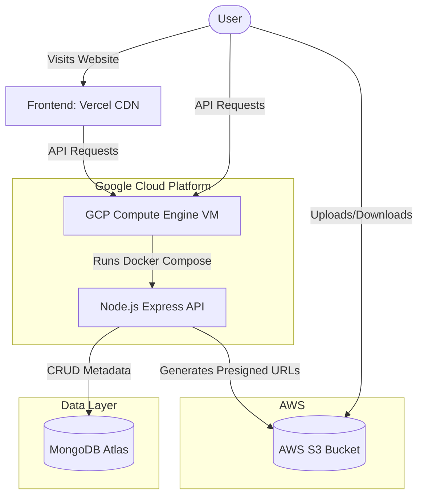
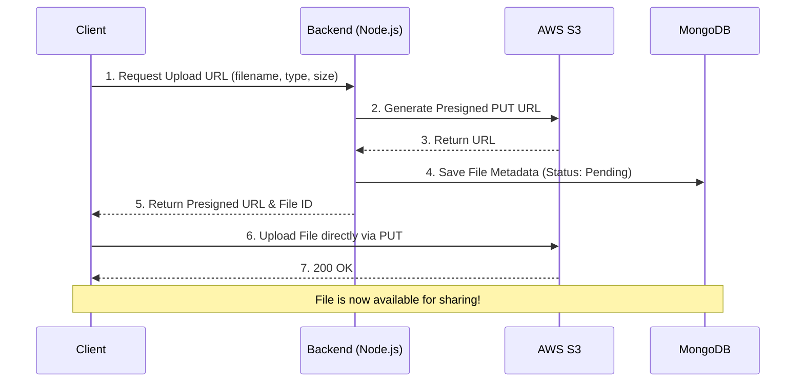

# FileGo Architecture

FileGo is a modern, high-performance file sharing application. The infrastructure is designed to be highly scalable and cost-effective, leveraging a multi-cloud approach via Terraform.

## High-Level System Architecture

## Data Flow: File Upload via Presigned URL

To avoid routing heavy file uploads through the Node.js backend, FileGo uses AWS S3 Presigned URLs.

