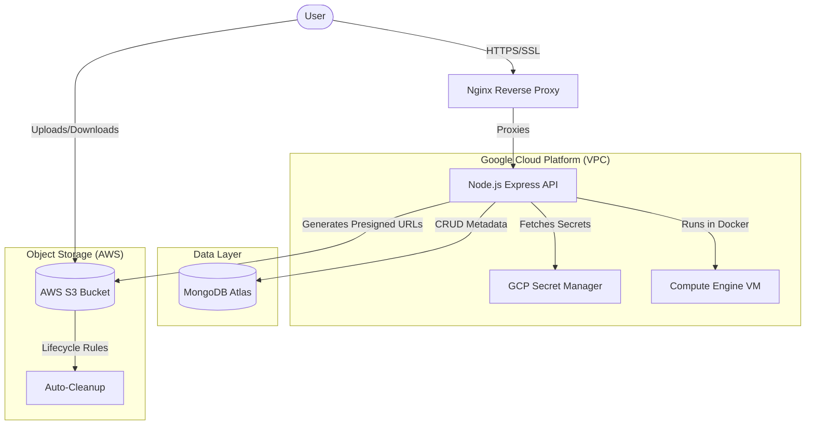
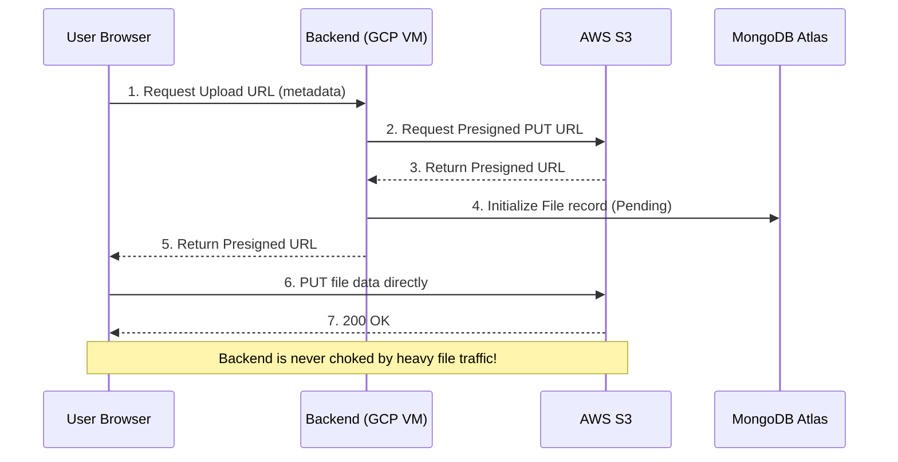

# FileGo Production Architecture

FileGo is a production-grade, high-performance file sharing application. The infrastructure is designed for high availability, security, and cost-effectiveness, leveraging a multi-cloud approach pr[...]

## High-Level System Architecture

## Security & Configuration Layer

Unlike standard applications that rely on local `.env` files, FileGo uses a **centralized configuration management** system:

1. **GCP Secret Manager**: Acts as the single source of truth for all production credentials (JWT secrets, API keys, DB URIs).
2. **Infrastructure as Code (IaC)**: Terraform manages the secret versions and access policies, ensuring that only the application VM has the necessary permissions to read them.
3. **SSL Termination**: Nginx handles Let's Encrypt certificates, ensuring all client-to-server communication is encrypted via TLS 1.3.

## Data Flow: File Upload via Presigned URL

To maximize throughput and minimize server overhead, FileGo utilizes the **Direct-to-Cloud** upload pattern.

## DevOps & Deployment Flow

1. **Development**: Code is written and tested locally.
2. **CI (GitHub Actions)**: Every push triggers 39+ automated tests.
3. **CD (GitHub Actions)**: Successful builds on `deploy` branch are pushed to the GCP VM, secrets are synced, and containers are restarted using a rolling update strategy.
